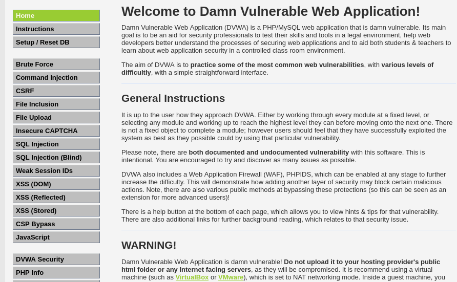
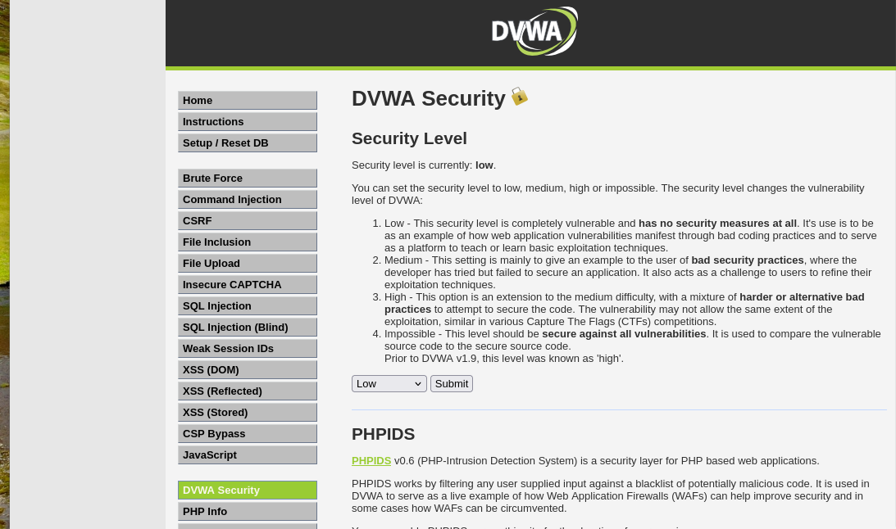
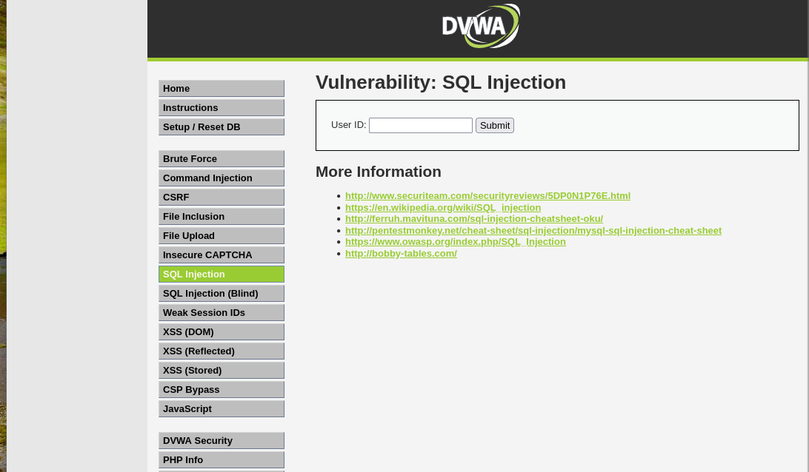
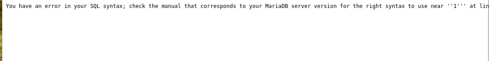
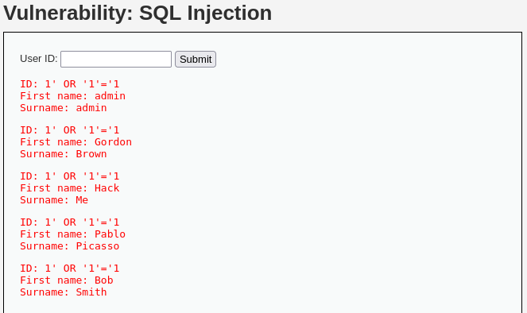

# SQL Injection Exploitation on DVWA (Kali Linux Lab)

## Overview
This project demonstrates a SQL Injection attack using DVWA in a controlled lab environment. It shows how improper input validation can allow attackers to extract sensitive data from a database.

## Objective
Exploit SQL Injection vulnerability in DVWA to extract user data.

## Tools Used
- Kali Linux
- Docker
- DVWA
- Web Browser

## Steps
1. Deployed DVWA using Docker
2. Set security level to LOW
3. Navigated to SQL Injection module
4. Tested malformed input (1')
5. The payload `' OR '1'='1` forces the SQL query to always evaluate to TRUE, bypassing authentication and returning all records from the database.
6. Retrieved multiple user records

## Result
Successfully extracted multiple user records from the database.

## Security Insight
Application does not sanitize input, allowing attackers to manipulate SQL queries and access sensitive data.

## Screenshots

### Login Page

### Security Level (Low)

### SQL Injection Page

### SQL Error

### SQL Injection Success

## Mitigation
- Use parameterized queries (prepared statements)
- Validate and sanitize user input
- Implement least privilege for database users
- Use Web Application Firewalls (WAF)

